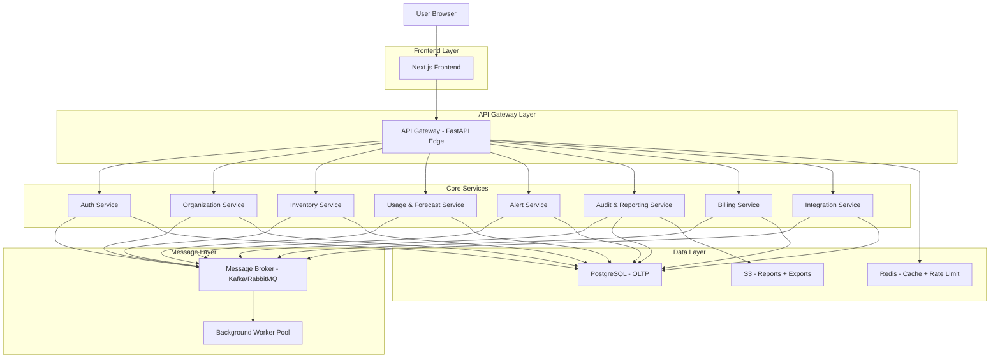
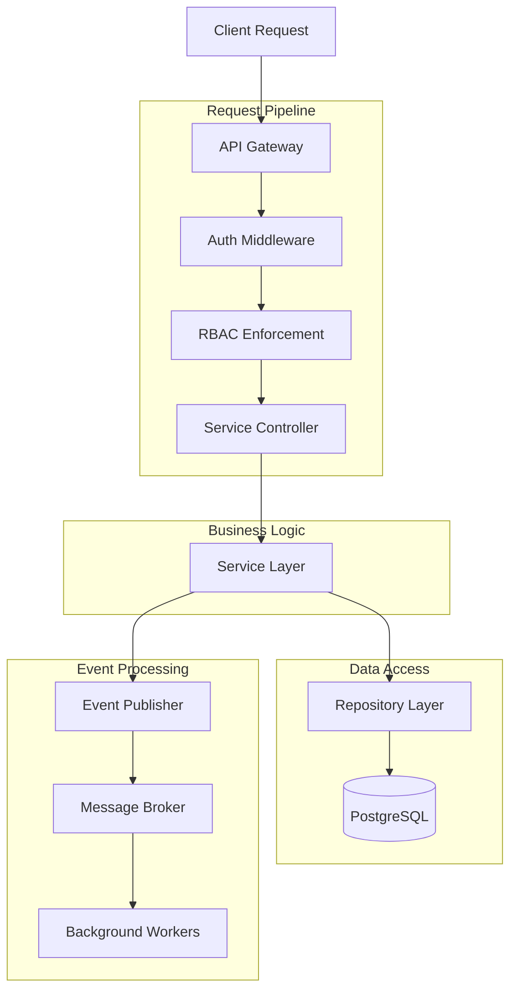
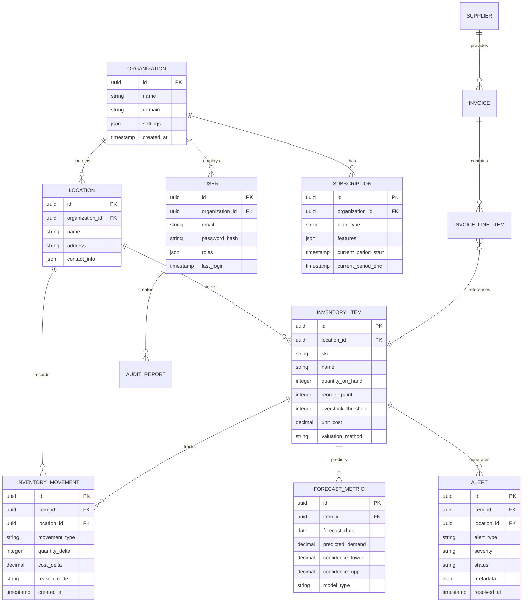

## 1. Architecture Design



## 2. Technology Description

- **Frontend**: Next.js@14 + React@18 + TypeScript + TailwindCSS
- **API Gateway**: FastAPI@0.104 + Python@3.11 + Uvicorn
- **Microservices**: Node.js@20 + Express@4 + TypeScript
- **Message Broker**: Apache Kafka@3.5 + KafkaJS
- **Database**: PostgreSQL@15 + Supabase
- **Cache**: Redis@7 + ioredis
- **Storage**: AWS S3 + Presigned URLs
- **Container**: Docker + Kubernetes
- **CI/CD**: GitHub Actions

## 3. Route Definitions

| Route | Purpose |
|-------|---------|
| / | Dashboard - Executive overview and key metrics |
| /inventory | Inventory management - Stock levels, transfers, adjustments |
| /analytics | Analytics and reporting - Forecasts, valuations, custom reports |
| /alerts | Alert center - Configuration, history, resolution management |
| /integrations | Integration hub - Accounting sync, API management |
| /organization | Organization settings - Locations, users, roles |
| /billing | Billing and subscription - Plan management, usage tracking |
| /api/auth/* | Authentication endpoints - Login, logout, refresh |
| /api/inventory/* | Inventory API - CRUD operations, transfers |
| /api/forecast/* | Forecast API - Demand predictions, metrics |
| /api/alerts/* | Alert API - Configuration, notifications |
| /api/reports/* | Reporting API - PDF generation, exports |
| /api/integrations/* | Integration API - Accounting sync, webhooks |

## 4. API Definitions

### 4.1 Authentication API

```
POST /api/auth/login
```

Request:
| Param Name | Param Type | isRequired | Description |
|------------|------------|-------------|-------------|
| email | string | true | User email address |
| password | string | true | User password |
| organization_id | string | false | Organization identifier (for multi-tenant) |

Response:
| Param Name | Param Type | Description |
|------------|-------------|-------------|
| access_token | string | JWT access token |
| refresh_token | string | JWT refresh token |
| user | object | User profile data |
| roles | array | User role assignments |

Example:
```json
{
  "email": "admin@company.com",
  "password": "secure_password",
  "organization_id": "org_123"
}
```

### 4.2 Inventory API

```
POST /api/inventory/transfer
```

Request:
| Param Name | Param Type | isRequired | Description |
|------------|------------|-------------|-------------|
| from_location_id | string | true | Source location identifier |
| to_location_id | string | true | Destination location identifier |
| items | array | true | Array of items to transfer |
| reason | string | false | Transfer reason code |

Response:
| Param Name | Param Type | Description |
|------------|-------------|-------------|
| transfer_id | string | Unique transfer identifier |
| status | string | Transfer status (pending/approved/completed) |
| estimated_delivery | datetime | Expected delivery timestamp |

### 4.3 Forecast API

```
GET /api/forecast/demand/{sku}
```

Request Parameters:
| Param Name | Param Type | isRequired | Description |
|------------|------------|-------------|-------------|
| horizon | integer | false | Forecast horizon in days (default: 30) |
| location_id | string | false | Specific location filter |

Response:
| Param Name | Param Type | Description |
|------------|-------------|-------------|
| sku | string | Product SKU |
| forecast | array | Time series forecast data |
| confidence_intervals | object | Upper/lower confidence bounds |
| seasonality_factors | array | Detected seasonal patterns |

## 5. Server Architecture Diagram



## 6. Data Model

### 6.1 Entity Relationship Diagram



### 6.2 Data Definition Language

Organizations Table:
```sql
CREATE TABLE organizations (
    id UUID PRIMARY KEY DEFAULT gen_random_uuid(),
    name VARCHAR(255) NOT NULL,
    domain VARCHAR(255) UNIQUE,
    settings JSONB DEFAULT '{}',
    created_at TIMESTAMP WITH TIME ZONE DEFAULT NOW(),
    updated_at TIMESTAMP WITH TIME ZONE DEFAULT NOW()
);

-- Row-level security
ALTER TABLE organizations ENABLE ROW LEVEL SECURITY;
CREATE POLICY organization_isolation ON organizations 
    USING (id = current_setting('app.current_org_id')::UUID);

-- Grant permissions
GRANT SELECT ON organizations TO anon;
GRANT ALL ON organizations TO authenticated;
```

Inventory Items Table:
```sql
CREATE TABLE inventory_items (
    id UUID PRIMARY KEY DEFAULT gen_random_uuid(),
    location_id UUID NOT NULL REFERENCES locations(id),
    sku VARCHAR(100) NOT NULL,
    name VARCHAR(255) NOT NULL,
    quantity_on_hand INTEGER DEFAULT 0,
    reorder_point INTEGER DEFAULT 0,
    overstock_threshold INTEGER DEFAULT 0,
    unit_cost DECIMAL(10,2) DEFAULT 0.00,
    valuation_method VARCHAR(10) DEFAULT 'FIFO' CHECK (valuation_method IN ('FIFO', 'LIFO', 'AVERAGE')),
    version INTEGER DEFAULT 1,
    created_at TIMESTAMP WITH TIME ZONE DEFAULT NOW(),
    updated_at TIMESTAMP WITH TIME ZONE DEFAULT NOW(),
    UNIQUE(location_id, sku)
);

-- Optimistic locking
CREATE INDEX idx_inventory_items_version ON inventory_items(version);
CREATE INDEX idx_inventory_items_location_sku ON inventory_items(location_id, sku);
CREATE INDEX idx_inventory_items_reorder ON inventory_items(location_id, reorder_point) WHERE quantity_on_hand <= reorder_point;

-- Row-level security
ALTER TABLE inventory_items ENABLE ROW LEVEL SECURITY;
CREATE POLICY inventory_org_isolation ON inventory_items
    USING (location_id IN (SELECT id FROM locations WHERE organization_id = current_setting('app.current_org_id')::UUID));
```

Inventory Movements Table:
```sql
CREATE TABLE inventory_movements (
    id UUID PRIMARY KEY DEFAULT gen_random_uuid(),
    item_id UUID NOT NULL REFERENCES inventory_items(id),
    location_id UUID NOT NULL REFERENCES locations(id),
    movement_type VARCHAR(50) NOT NULL CHECK (movement_type IN ('IN', 'OUT', 'TRANSFER_IN', 'TRANSFER_OUT', 'ADJUSTMENT')),
    quantity_delta INTEGER NOT NULL,
    cost_delta DECIMAL(10,2) DEFAULT 0.00,
    reason_code VARCHAR(100),
    reference_id UUID,
    created_by UUID REFERENCES users(id),
    created_at TIMESTAMP WITH TIME ZONE DEFAULT NOW()
);

-- Partitioning by organization
CREATE INDEX idx_movements_item_location ON inventory_movements(item_id, location_id);
CREATE INDEX idx_movements_created_at ON inventory_movements(created_at DESC);
CREATE INDEX idx_movements_type ON inventory_movements(movement_type);
```

Forecast Metrics Table:
```sql
CREATE TABLE forecast_metrics (
    id UUID PRIMARY KEY DEFAULT gen_random_uuid(),
    item_id UUID NOT NULL REFERENCES inventory_items(id),
    forecast_date DATE NOT NULL,
    predicted_demand DECIMAL(10,2) NOT NULL,
    confidence_lower DECIMAL(10,2),
    confidence_upper DECIMAL(10,2),
    model_type VARCHAR(50) NOT NULL,
    model_accuracy DECIMAL(5,2),
    created_at TIMESTAMP WITH TIME ZONE DEFAULT NOW(),
    UNIQUE(item_id, forecast_date, model_type)
);

CREATE INDEX idx_forecast_item_date ON forecast_metrics(item_id, forecast_date);
CREATE INDEX idx_forecast_created ON forecast_metrics(created_at DESC);
```

Alerts Table:
```sql
CREATE TABLE alerts (
    id UUID PRIMARY KEY DEFAULT gen_random_uuid(),
    item_id UUID REFERENCES inventory_items(id),
    location_id UUID REFERENCES locations(id),
    alert_type VARCHAR(50) NOT NULL CHECK (alert_type IN ('LOW_STOCK', 'OVERSTOCK', 'DEAD_INVENTORY', 'LEAD_TIME_VARIANCE')),
    severity VARCHAR(20) NOT NULL CHECK (severity IN ('LOW', 'MEDIUM', 'HIGH', 'CRITICAL')),
    status VARCHAR(20) DEFAULT 'ACTIVE' CHECK (status IN ('ACTIVE', 'ACKNOWLEDGED', 'RESOLVED')),
    metadata JSONB DEFAULT '{}',
    assigned_to UUID REFERENCES users(id),
    resolved_at TIMESTAMP WITH TIME ZONE,
    created_at TIMESTAMP WITH TIME ZONE DEFAULT NOW(),
    updated_at TIMESTAMP WITH TIME ZONE DEFAULT NOW()
);

CREATE INDEX idx_alerts_status ON alerts(status);
CREATE INDEX idx_alerts_severity ON alerts(severity);
CREATE INDEX idx_alerts_location ON alerts(location_id);
CREATE INDEX idx_alerts_assigned ON alerts(assigned_to);
```

Audit Reports Table:
```sql
CREATE TABLE audit_reports (
    id UUID PRIMARY KEY DEFAULT gen_random_uuid(),
    organization_id UUID NOT NULL REFERENCES organizations(id),
    report_type VARCHAR(100) NOT NULL,
    report_config JSONB NOT NULL,
    file_path VARCHAR(500),
    file_size INTEGER,
    generated_by UUID REFERENCES users(id),
    status VARCHAR(20) DEFAULT 'PENDING' CHECK (status IN ('PENDING', 'PROCESSING', 'COMPLETED', 'FAILED')),
    expires_at TIMESTAMP WITH TIME ZONE,
    created_at TIMESTAMP WITH TIME ZONE DEFAULT NOW()
);

CREATE INDEX idx_audit_reports_org ON audit_reports(organization_id);
CREATE INDEX idx_audit_reports_status ON audit_reports(status);
CREATE INDEX idx_audit_reports_expires ON audit_reports(expires_at);
```