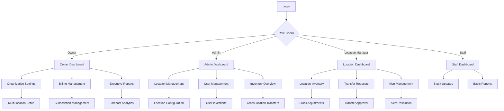

## 1. Product Overview
Enterprise-Level Inventory Intelligence SaaS designed for multi-location businesses, franchises, and regional distributors. The platform provides predictive inventory management, accounting integration, and real-time analytics to optimize working capital and automate reorder decisions.

Target market: Multi-location retail chains, franchise operations, regional distributors, and accounting-integrated operators seeking inventory intelligence infrastructure.

## 2. Core Features

### 2.1 User Roles
| Role | Registration Method | Core Permissions |
|------|---------------------|------------------|
| Owner | Email + Organization setup | Full organization access, billing management, API keys |
| Admin | Owner invitation | Location management, user management, inventory control |
| Location Manager | Admin invitation | Single location inventory, transfers, reporting |
| Staff | Location Manager invitation | Stock updates, basic inventory viewing |

### 2.2 Feature Module
Enterprise Inventory Intelligence platform consists of the following main pages:
1. **Dashboard**: Executive overview, key metrics, alert summary, forecast trends.
2. **Inventory Management**: Multi-location stock levels, transfers, adjustments, serialized tracking.
3. **Analytics & Reports**: Demand forecasting, inventory valuation, turnover analysis, custom reports.
4. **Alert Center**: Low stock alerts, overstock warnings, dead inventory notifications.
5. **Integration Hub**: Accounting system connections, API management, webhook configurations.
6. **Organization Settings**: Multi-location hierarchy, user management, role assignments.
7. **Billing & Subscription**: Plan management, usage tracking, payment history.

### 2.3 Page Details
| Page Name | Module Name | Feature description |
|-----------|-------------|---------------------|
| Dashboard | Executive Overview | Display total inventory value, cash tied up, working capital exposure, turnover ratio. |
| Dashboard | Alert Summary | Show active alerts by severity, quick resolution actions, alert history. |
| Dashboard | Forecast Trends | Visualize 30/60/90-day demand predictions, seasonality indicators. |
| Inventory Management | Stock Levels | View real-time inventory across all locations, search by SKU, filter by location. |
| Inventory Management | Transfer System | Create inter-location transfers, track transfer status, approve/reject requests. |
| Inventory Management | Adjustments | Record stock adjustments with reason codes, maintain audit trail. |
| Analytics & Reports | Demand Forecasting | Calculate rolling demand, detect seasonality, model forecast horizons. |
| Analytics & Reports | Inventory Valuation | FIFO/LIFO valuation, real-time cost calculations, valuation reports. |
| Analytics & Reports | Custom Reports | Generate PDF/CSV exports, schedule automated reports, share via signed URLs. |
| Alert Center | Alert Configuration | Set reorder points, overstock thresholds, configure notification channels. |
| Alert Center | Alert History | Track alert lifecycle, resolution status, assign to team members. |
| Integration Hub | Accounting Sync | Connect QuickBooks, sync invoices, import purchase orders, vendor data. |
| Integration Hub | API Management | Generate API keys, configure webhooks, monitor API usage. |
| Organization Settings | Location Management | Add/remove locations, configure hierarchies, set location-specific settings. |
| Organization Settings | User Management | Invite users, assign roles, manage permissions, track user activity. |
| Billing & Subscription | Plan Selection | Choose subscription tiers, view feature comparisons, upgrade/downgrade. |
| Billing & Subscription | Usage Tracking | Monitor API calls, location count, storage usage, overage calculations. |

## 3. Core Process

### Owner Flow
1. Register organization and set up billing
2. Configure multi-location hierarchy
3. Invite admin users and assign roles
4. Set up accounting integrations
5. Configure alert thresholds and notification channels
6. Monitor executive dashboard and key metrics
7. Review automated reports and forecasts

### Admin Flow
1. Receive organization invitation
2. Set up individual locations
3. Configure inventory parameters per location
4. Manage user invitations and role assignments
5. Oversee inventory transfers between locations
6. Review and resolve alerts
7. Generate operational reports

### Location Manager Flow
1. Access assigned location dashboard
2. Update stock levels and record movements
3. Request inventory transfers
4. Review location-specific alerts
5. Generate location reports
6. Manage staff user activities

### Staff Flow
1. Log in to assigned location
2. Update inventory quantities
3. View stock levels and alerts
4. Process basic inventory transactions

## 4. User Interface Design

### 4.1 Design Style
- **Primary Colors**: Professional blue (#1E40AF), white background, gray accents (#6B7280)
- **Secondary Colors**: Success green (#10B981), warning amber (#F59E0B), error red (#EF4444)
- **Button Style**: Rounded corners (8px), subtle shadows, hover animations
- **Font**: Inter for headings, Roboto for body text
- **Layout**: Card-based dashboard, top navigation with sidebar for desktop
- **Icons**: Feather Icons library, consistent 16px/24px sizing

### 4.2 Page Design Overview
| Page Name | Module Name | UI Elements |
|-----------|-------------|-------------|
| Dashboard | Executive Overview | Card-based metrics grid, sparkline charts, color-coded KPI indicators, responsive tile layout. |
| Dashboard | Alert Summary | Priority-based color coding, expandable alert cards, quick action buttons, filter dropdowns. |
| Inventory Management | Stock Levels | Data table with search bar, location filter dropdown, inline editing, bulk actions toolbar. |
| Analytics & Reports | Forecast Charts | Interactive line charts, confidence bands, seasonality indicators, export button group. |
| Alert Center | Alert Configuration | Form-based threshold settings, channel selection toggles, test notification button. |
| Integration Hub | Accounting Sync | Connection status indicators, sync progress bars, error log viewer, retry controls. |

### 4.3 Responsiveness
Desktop-first design with mobile-responsive adaptations. Touch-optimized interactions for tablet use. Collapsible navigation for smaller screens. Priority-based content hiding on mobile devices.

### 4.4 Enterprise UI Considerations
- Professional, clean interface suitable for executive presentations
- High contrast for accessibility compliance
- Keyboard navigation support
- Bulk operation capabilities
- Advanced filtering and search
- Export functionality prominently displayed
- Multi-select capabilities for batch operations